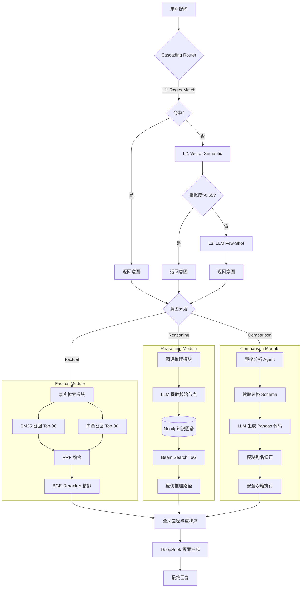

# Medical-Insight: 医疗领域自适应多路召回 RAG 系统

**Medical-Insight** 是一个针对医疗垂直领域设计的增强型 RAG（检索增强生成）系统。针对传统 RAG 在处理**多跳推理**、**精确数值对比**和**专业名词检索**时的痛点，本项目提出了一种基于意图识别的**分层级联路由架构**，将问题智能分发给 **Factual（事实检索）**、**Reasoning（图谱推理）** 和 **Comparison（表格分析）** 三大专家模块处理。

## 📋 目录
- [核心特性](#-核心特性-key-features)
- [系统架构](#️-系统架构-architecture)
- [项目结构](#-项目结构-file-structure)
- [快速开始](#-快速开始-quick-start)
- [实验与评测](#-实验与评测-experiments)
- [核心配置](#️-核心配置-configuration)
- [技术细节](#-技术细节-technical-details)

---

## 🌟 核心特性 (Key Features)

### 1. **🧠 级联意图路由 (Cascading Router)**
* **三级策略**: 采用 `L1: Regex (正则)` -> `L2: Vector Semantic (向量语义)` -> `L3: LLM (大模型)` 的级联策略
* **效率优化**: 优先使用轻量级方法（正则匹配、本地向量模型），仅在必要时调用 LLM，大幅降低延迟与 Token 成本
* **支持意图**:
  - `factual`: 事实查证（定义、症状、用法等）
  - `reasoning`: 复杂推理（病因机制、后果预后等）
  - `comparison`: 数值对比（价格、疗效比较等）

### 2. **🕸️ 图谱思维链推理 (Graph-based ToG Reasoning)**
* **Think-on-Graph (ToG)**: 采用 Beam Search 策略在知识图谱上进行多跳推理
* **动态路径选择**: 利用向量相似度引导 LLM 在图谱中探索最相关的推理路径
* **支持深度推理**: 支持 2-3 跳的复杂推理，解决"并发症的伴随症状"等问题
* **对比 Standard GraphRAG**: 传统方法仅检索 1-hop 邻居，本系统实现智能的多跳路径搜索

### 3. **📚 混合检索与全局重排序 (Hybrid Retrieval + Global Reranking)**
* **双路召回**:
  - BM25（基于 jieba 分词的关键词稀疏检索）
  - ChromaDB（BGE-small 向量稠密检索）
* **RRF 融合**: 使用 Reciprocal Rank Fusion 算法融合多路召回结果
* **Cross-Encoder 重排**: 使用 BGE-Reranker-Base 进行精细重排序
* **全局去噪**: 对所有模块（事实、推理、表格）的证据统一打分排序

### 4. **📊 表格分析 Agent (Code-based Tabular Agent)**
* **动态代码生成**: 针对结构化数据查询，自动生成 Pandas 代码
* **模糊列名修正**: 使用 difflib 自动纠正 LLM 产生的列名幻觉
* **安全沙箱执行**: 在受限环境中执行代码，防止恶意操作
* **消除数值幻觉**: 通过实际计算替代 LLM 估算，提高准确性

### 5. **🎯 消融实验支持 (Ablation Study)**
系统支持多种运行模式，便于评估各模块贡献：
- `full`: 完整系统（路由 + 图谱 + 表格）
- `no_routing`: 禁用路由（所有模块并行调用）
- `no_graph`: 禁用图谱推理
- `no_agent`: 禁用表格 Agent

---

## 🛠️ 系统架构 (Architecture)



---

## 📂 项目结构 (File Structure)

```text
agents/
├── main_system.py              # 🚀 系统主入口（MedicalQASystem 核心类）
├── run_demo.py                 # 🎮 交互式演示脚本
├── run_all_benchmarks.py       # 📊 全量基线评测自动运行器
│
├── Core_modules/               # 核心功能模块
│   ├── router_module.py        # 级联路由器（Regex + Vector + LLM）
│   ├── reasoning_module.py     # 图谱推理（ToG + Standard KGQA）
│   ├── factual_module.py       # 事实检索（BM25 + Vector + Rerank）
│   └── comparison_module.py    # 表格 Agent（代码生成与执行）
│
├── Baselines/                  # 📉 基线模型实现
│   ├── Naive_RAG.py            # 纯向量检索 RAG
│   ├── Hybrid_RAG.py           # 混合检索 RAG（BM25 + Vector）
│   └── StdGraph_RAG.py         # 标准 GraphRAG（1-hop 邻居检索）
│
├── Experiment/                 # 📊 评测脚本
│   ├── Ours_evaluate.py        # 本系统全量评测
│   ├── Router.py               # 路由模块专项评测
│   ├── Multihop.py             # 多跳推理能力评测
│   ├── Tabular.py              # 表格查询能力评测
│   └── Ablation.py             # 消融实验（4 种模式）
│
├── Data_utils/                 # 🛠️ 数据处理工具
│   ├── build_vector_index.py  # 构建向量索引（已弃用）
│   ├── fix_vector_index.py    # 修复向量索引
│   ├── rebuild_db.py           # 重建 ChromaDB（推荐使用）
│   ├── load_MedQA.py           # MedQA 数据加载器
│   ├── router_data.py          # 生成路由测试数据
│   ├── router_hybrid_data.py   # 生成混合路由数据
│   ├── table_data.py           # 生成表格测试数据
│   ├── multihop_data.py        # 生成多跳推理数据
│   └── upload_to_server.py     # 服务器部署脚本
│
├── Visualization/              # 📈 结果可视化
│   ├── plot_rag_results.py     # RAG 整体性能对比图
│   ├── plot_ablation.py        # 消融实验结果绘图
│   └── plot_exp3.py            # 子模块实验绘图
│
├── data/                       # 数据目录
│   ├── build_neo4j.py          # Neo4j 知识图谱构建脚本
│   ├── build_vector_index.py  # 向量索引构建脚本
│   ├── fix_vector_index.py    # 向量索引修复脚本
│   ├── medical_data.xlsx       # 药品结构化数据表
│   └── synonyms.txt            # 医学同义词词典（可选）
│
├── MedQA/                      # 评测数据集
│   └── questions/Mainland/4_options/
│       └── test.jsonl          # MedQA 测试集（500 题）
│
├── chroma_db_medqa_chunked/    # 预处理的向量数据库
└── .venv/                      # Python 虚拟环境
```

---

## 🚀 快速开始 (Quick Start)

### 1. 环境准备

**系统要求**:
- Python 3.8+
- CUDA（推荐，用于加速向量模型）
- Neo4j 4.x+（用于知识图谱）

**安装依赖**:

```bash
pip install openai pandas tqdm neo4j chromadb sentence-transformers \
            rank-bm25 jieba pycorrector transformers scikit-learn \
            openpyxl matplotlib seaborn torch
```

**外部服务配置**:

1. **Neo4j 知识图谱**:
   ```bash
   # 启动 Neo4j（默认端口 7687）
   # 设置用户名: neo4j
   # 设置密码: 在代码中配置
   ```

2. **DeepSeek API**:
   - 注册并获取 API Key: https://platform.deepseek.com
   - 在配置文件中填入 `api_key` 和 `base_url`

### 2. 数据初始化

#### 步骤 A: 构建向量数据库

运行以下命令从医学文本数据构建向量索引：

```bash
python Data_utils/rebuild_db.py
```

这将：
- 读取医学教科书数据
- 使用 RecursiveCharacterTextSplitter 进行分块
- 使用 BGE-small-zh 模型编码
- 存储到 `chroma_db_medqa_chunked/` 目录

#### 步骤 B: 构建知识图谱

```bash
python data/build_neo4j.py
```

这将创建包含以下节点和关系的医学知识图谱：
- 节点类型: Disease（疾病）, Symptom（症状）, Drug（药物）, Check（检查）
- 关系类型: has_symptom, acompany_with, need_check, recommand_drug

#### 步骤 C: （可选）生成测试数据

如需评估系统性能，可生成专项测试集：

```bash
python Data_utils/router_data.py        # 路由分类测试集
python Data_utils/table_data.py         # 表格查询测试集
python Data_utils/multihop_data.py      # 多跳推理测试集
```

### 3. 运行交互式 Demo

启动命令行问答系统：

```bash
python run_demo.py
```

**示例对话**:
```
👨‍⚕️ 问题: 阿司匹林和布洛芬哪个更便宜？
🤖 回答: [触发 Comparison 模块] 根据数据分析...

👨‍⚕️ 问题: 高血压为什么会导致脑出血？
🤖 回答: [触发 Reasoning 模块] 推理路径: 高血压 --损伤--> 血管壁 --破裂--> 脑出血...

👨‍⚕️ 问题: 糖尿病的诊断标准是什么？
🤖 回答: [触发 Factual 模块] 根据文献检索...
```

---

## 🧪 实验与评测 (Experiments)

本项目包含完整的 Baseline 对比实验与消融实验，支持复现。

### 📊 实验一：RAG 综合性能对比

对比三种 RAG 范式在 MedQA 测试集（500题）上的表现：

1. **Naive RAG** - 纯向量检索:
   ```bash
   python Baselines/Naive_RAG.py
   ```
   - 仅使用 ChromaDB 向量检索 Top-5
   - 优点: 速度快
   - 缺点: 召回率低，无法处理专业术语变体

2. **Hybrid RAG** - 混合检索:
   ```bash
   python Baselines/Hybrid_RAG.py
   ```
   - BM25 + Vector + Reranker
   - 优点: 召回率高
   - 缺点: 缺乏推理能力

3. **Standard GraphRAG** - 标准图谱检索:
   ```bash
   python Baselines/StdGraph_RAG.py
   ```
   - LLM 提取实体 -> Neo4j 1-hop 邻居检索
   - 优点: 结构化知识
   - 缺点: 仅支持单跳，路径单一

4. **Ours (Medical-Insight)** - 自适应多路召回系统:
   ```bash
   python Experiment/Ours_evaluate.py
   ```
   - 级联路由 + ToG 推理 + 混合检索 + 表格 Agent
   - 优点: 全面性、准确性、可解释性

**可视化对比**:
```bash
python Visualization/rag_results_plot.py
```

### 🏎️ 实验二：路由模块性能评估

测试路由器在不同层级的命中率、准确率与延迟：

```bash
python Experiment/Router.py
```

**评估指标**:
- L1（正则）命中率
- L2（向量语义）命中率
- L3（LLM）调用率
- 平均延迟对比

### 🧩 实验三：消融实验 (Ablation Study)

测试移除特定模块后的性能下降：

```bash
python Experiment/Ablation.py
```

**测试模式**:
- `full`: 完整系统（基线）
- `no_routing`: 禁用路由器（所有模块并行调用，测试路由的必要性）
- `no_graph`: 禁用图谱推理（测试 ToG 的贡献）
- `no_agent`: 禁用表格 Agent（测试代码生成的价值）

**可视化结果**:
```bash
python Visualization/ablation_plot.py
```

### 🔬 实验四：专项能力评测

**多跳推理能力**:
```bash
python Experiment/Multihop.py
```

**表格查询能力**:
```bash
python Experiment/Tabular.py
```

### 🚀 一键运行所有实验

```bash
python run_all_benchmarks.py
```

该脚本将按序运行所有基线和消融实验（预计耗时 8-12 小时），并自动保存结果到 `runs/` 目录。

---

## ⚙️ 核心配置 (Configuration)

所有脚本均包含 `CONFIG` 字典，请根据实际环境修改：

```python
CONFIG = {
    # ========== API 配置 ==========
    "api_key": "sk-xxxxxx",                  # DeepSeek API Key
    "base_url": "https://api.deepseek.com",  # DeepSeek API 地址

    # ========== 数据库配置 ==========
    "neo4j_uri": "bolt://localhost:7687",    # Neo4j 连接地址
    "neo4j_user": "neo4j",                   # Neo4j 用户名
    "neo4j_password": "your_password",       # Neo4j 密码（请修改）

    "chroma_path": "./chroma_db_medqa_chunked",  # 向量数据库路径

    # ========== 模型配置 ==========
    "embedding_model": "BAAI/bge-small-zh-v1.5",  # 向量编码模型
    "device": "cuda",                             # 设备（cuda 或 cpu）

    # ========== 数据路径 ==========
    "table_path": "data/medical_data.xlsx",      # 结构化数据表
    "synonym_path": "data/synonyms.txt",         # 同义词词典（可选）
    "eval_file": "./MedQA/questions/Mainland/4_options/test.jsonl",  # 测试集

    # ========== 评测配置 ==========
    "test_limit": 500,  # 测试集大小（None 为全量）
}
```

**注意事项**:
1. **API Key 安全**: 请勿将 API Key 提交到公开仓库
2. **HuggingFace 镜像**: 国内用户可在脚本开头添加 `os.environ["HF_ENDPOINT"] = "https://hf-mirror.com"`
3. **显存优化**: 如遇显存不足，可将 `embedding_model` 改为 `BAAI/bge-small-zh-v1.5`（已是最小模型）或设置 `device="cpu"`

---

## 🔍 技术细节 (Technical Details)

### 路由器级联策略

**L1: 正则匹配**
- 延迟: ~0ms
- 覆盖率: ~30%
- 规则示例:
  ```python
  "comparison": [r"区别", r"对比", r"价格", r"哪个好"]
  "reasoning": [r"为什么", r"导致", r"机制", r"影响"]
  "factual": [r"是什么", r"定义", r"症状"]
  ```

**L2: 向量语义匹配**
- 延迟: ~10ms
- 覆盖率: ~50%
- 方法: 预计算意图原型向量，查询时计算余弦相似度
- 阈值: 0.65（可调）

**L3: LLM Few-Shot**
- 延迟: ~500ms
- 覆盖率: 100%（兜底）
- 优化: 使用精心设计的 Few-Shot Prompt，包含 5+ 示例

### ToG (Think-on-Graph) 实现细节

```python
# Beam Search 伪代码
beams = [{"node": start_entity, "path": [], "score": 1.0}]
for step in range(max_hops):
    for beam in beams:
        neighbors = get_neighbors(beam["node"])  # 从 Neo4j 获取邻居
        cand_vecs = encoder.encode(neighbors)     # 向量化
        sims = cosine_similarity(query_vec, cand_vecs)  # 计算相似度
        top_k = argsort(sims)[-beam_width:]      # 选择 Top-K
        new_beams.append(...)
    beams = new_beams[:beam_width]  # 剪枝
```

**关键参数**:
- `max_hops`: 3（最大跳数）
- `beam_width`: 3（每步保留路径数）
- 相似度阈值: 0.25（噪声截断）

### 全局重排序机制

```python
# 收集所有模块的证据
candidates = []
candidates.extend(factual_docs)      # 事实检索结果
candidates.append(reasoning_path)    # 图谱推理路径
candidates.append(table_result)      # 表格分析结果

# 使用 Reranker 统一打分
pairs = [[query, cand] for cand in candidates]
scores = reranker.predict(pairs)

# 选择 Top-4
top_indices = argsort(scores)[-4:]
final_context = [candidates[i] for i in top_indices]
```

### 表格 Agent 错误处理

```python
for attempt in range(2):  # 最多重试 2 次
    try:
        code = llm.generate_code(query, schema)
        code = fuzzy_correct_columns(code)  # 列名纠错
        exec(code, {"df": dataframe}, local_scope)
        return local_scope["Result"]
    except Exception as e:
        prompt += f"\nError: {e}\nPlease fix the code."
```

---

## 📝 常见问题 (FAQ)

**Q1: 启动时显示 "ChromaDB 是空的"？**

A: 请先运行 `python Data_utils/rebuild_db.py` 构建向量数据库。

**Q2: Neo4j 连接失败？**

A: 检查：
1. Neo4j 服务是否启动（默认端口 7687）
2. 用户名密码是否正确
3. 防火墙是否允许连接

**Q3: 显存不足 (CUDA Out of Memory)？**

A: 尝试以下方法：
1. 设置 `device="cpu"`（牺牲速度）
2. 减少 `beam_width` 和 `max_hops`
3. 使用更小的 embedding 模型（已是最小）

**Q4: 路由准确率低？**

A: 可能原因：
1. 正则规则不匹配当前数据集 -> 调整 `router_module.py` 中的规则
2. 向量原型不够典型 -> 在 `prototypes` 中添加更多示例
3. LLM Few-Shot 示例不足 -> 优化 Prompt

**Q5: 如何添加新的医学数据源？**

A:
1. 将文本数据放入指定目录
2. 修改 `rebuild_db.py` 中的数据加载路径
3. 重新运行构建脚本

---

## 📄 许可证 (License)

本项目仅供学术研究使用。

---

## 🙏 致谢 (Acknowledgments)

本项目使用了以下开源工具和数据集：
- **Neo4j**: 图数据库
- **ChromaDB**: 向量数据库
- **Sentence-Transformers**: 向量编码（BGE 系列模型）
- **DeepSeek**: LLM API
- **MedQA**: 医学问答评测数据集

核心算法参考：
- **ToG (Think-on-Graph)**: 图谱推理策略
- **RRF (Reciprocal Rank Fusion)**: 多路召回融合
- **Cascading Router**: 级联意图识别

---

## 📧 联系方式 (Contact)

如有问题或建议，请通过以下方式联系：
- 提交 Issue
- 发送邮件至项目维护者

---

**⭐ 如果本项目对您有帮助，请给个 Star！**
